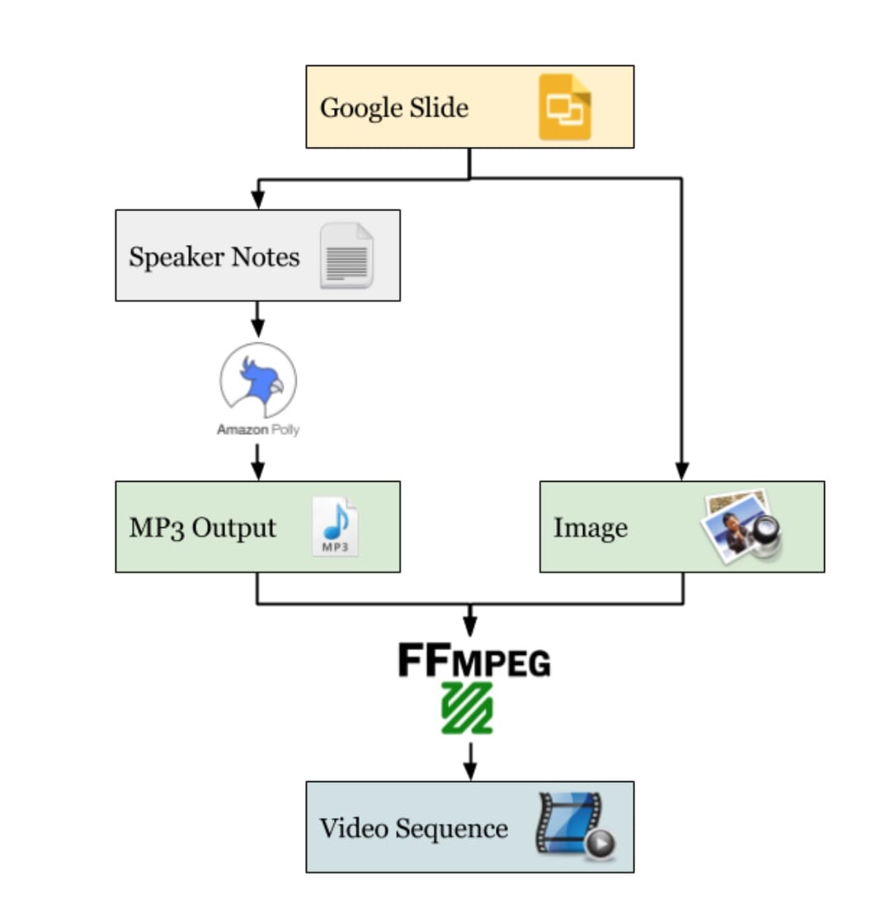
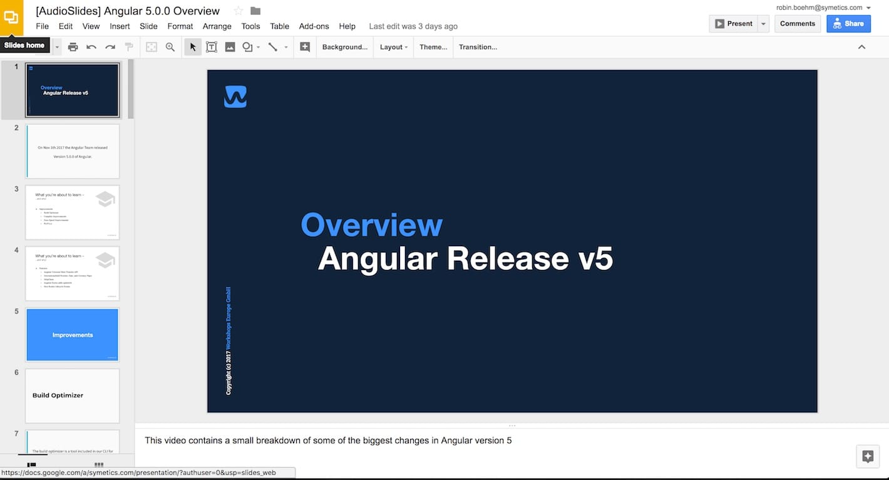

# AudioSlides.IO

## Articles

- [Produce Easy-to-Update Video Courses with Speech Synth](https://medium.com/@robinboehm/produce-easy-to-update-video-courses-with-speech-synth-484514879c94) by [Robin Böhm](https://twitter.com/robinboehm)

## tl;dr

Generate small videos with spoken text from Google Slides.

Using Amazon Polly, Google Slides and FFMpeg to create videos that can be updated at anytime by anyone. This project is written in Elixir.

## The Prototype
For our prototype we decided to give **Amazon Polly** a try. It has a good and simple HTTP-API that allows you to convert text to speech really easily.

For the visual layer we just used **Google Slides** because they also provide a really good REST-API that allows you to easily export PNG of a slide. It’s also possible to get the speaker notes via the same API that could be the input for the Amazon Polly transformation.

The last step is to combine the generated voice output with the exported png image and produce a small video sequence. For this we just used a handy command line interface called **FFMPEG**. So the basic processing would look something like this:

## Example Input & Output
As shown before we need a Google Presentation to start from. My input will be a short slide deck about the new release of Angular version 5.

### Google Slides as Input

### Generated Video as Output

## How to start the project

To start your Phoenix server:

  * Install dependencies with `mix deps.get`
  * Create and migrate your database with `mix ecto.create && mix ecto.migrate`
  * Install Node.js dependencies with `cd assets && npm install`
  * Start Phoenix endpoint with `mix s`

Now you can visit [`localhost:4000`](http://localhost:4000) from your browser.

## Use with docker

### Build the container

    docker build -t audioslides .

### Run via docker compose
Init the database

    docker-compose run web mix ecto.setup

Run database + project

    docker compose up

## How to test

Run all tests

    mix t

Run all test with integration test(ffmpeg, write files)

    mix test.integration